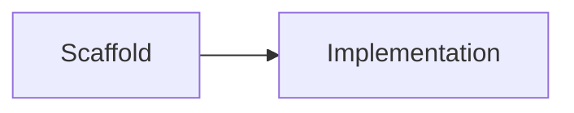

# portfolio-secure-cicd

> CI/CD with container security gates — Trivy, SBOM, and fail-on-CRITICAL PR checks.

## Problem this solves for a startup

_TODO: fill during implementation_

## Architecture



## Stack

| Layer | Choice |
|-------|--------|
| TBD | TBD |

## Prerequisites

- Docker / Docker Compose
- GitHub account

## Quickstart

```bash
# Coming in next commits
```

## What was automated

_TODO_

## Security notes

- No secrets in this repository
- Prefer OIDC over long-lived cloud keys

## Cost estimate / teardown

Prefer local demos. Cloud paths are opt-in and documented per-repo.

## Hire me for…

DevOps / Cloud consulting — [sauravrana646@gmail.com](mailto:sauravrana646@gmail.com) · [github.com/sauravrana646](https://github.com/sauravrana646)
