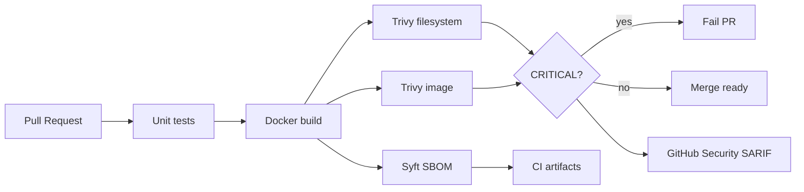

# portfolio-secure-cicd

> CI/CD with container security gates — Trivy, SBOM, and fail-on-CRITICAL PR checks so startups ship without ignoring CRITICAL image risk.

## Problem this solves for a startup

Optional scanners that nobody fails the build on. This repo shows a working pattern: unit tests → Docker build → Trivy (fs + image) → SBOM → SARIF, with CRITICAL findings failing the PR.

## Architecture



## Stack

| Layer | Choice |
|-------|--------|
| App | Python 3.12 + Flask + gunicorn |
| Containers | Multi-stage Dockerfile, non-root UID 10001 |
| CI | GitHub Actions |
| Scanning | Trivy (CRITICAL fail) |
| SBOM | Syft / Anchore sbom-action |
| Policy | `.trivyignore` + `policies/` |

## Prerequisites

- Docker / Docker Compose
- Python 3.12 (for local tests)
- Optional: [Trivy](https://aquasecurity.github.io/trivy/) for local scans

## Quickstart

```bash
# Local API
docker compose up --build
curl -s http://127.0.0.1:8080/healthz

# Unit tests
python3 -m venv .venv && source .venv/bin/activate
pip install -r app/requirements.txt
PYTHONPATH=. pytest -q

# Before/after image comparison (needs Trivy)
make compare
```

## What was automated

- PR/push CI: tests, image build, Trivy fs + image (fail CRITICAL), SBOM artifact, SARIF upload
- Documented OIDC deploy stub (disabled until AWS role exists)

## Security notes

- **Hardened** image: `Dockerfile` (used by CI)
- **Vulnerable** image: `Dockerfile.vulnerable` — local demo only; not built in CI
- No secrets in git; see `policies/oidc-aws-deploy-stub.md`
- Ignore policy: `policies/security-gates.md`

## Before / after hardening

| | Vulnerable | Hardened |
|-|------------|----------|
| File | `Dockerfile.vulnerable` | `Dockerfile` |
| User | root | non-root 10001 |
| Base | fat `python:3.9` | slim bookworm + upgrade |
| Stages | single | multi-stage |
| CI | not used | fail on CRITICAL |

Analogous engagement narrative: **150+ → &lt;30** findings after base/runtime hardening (example language — not a guarantee).

## Cost estimate / teardown

```bash
docker compose down
docker image rm portfolio-secure-cicd:hardened portfolio-secure-cicd:vulnerable 2>/dev/null || true
```

No cloud resources required for the demo.

## Hire me for…

**Security Hardening sprint** / secure CI/CD setup — [sauravrana646@gmail.com](mailto:sauravrana646@gmail.com) · [github.com/sauravrana646](https://github.com/sauravrana646)
