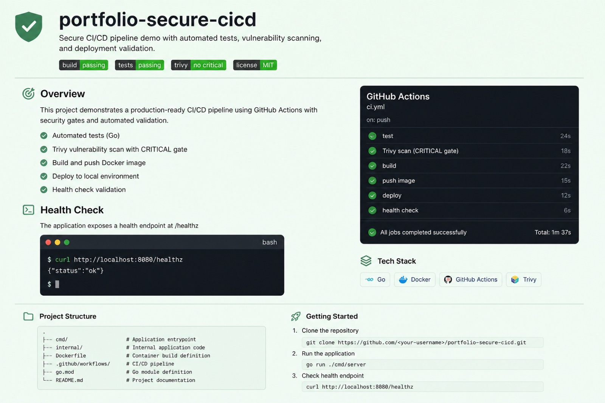
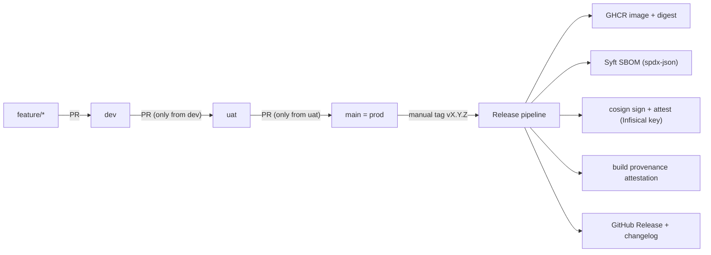
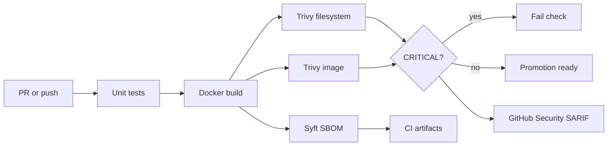

# portfolio-secure-cicd

[](https://github.com/sauravrana646/portfolio-secure-cicd/actions/workflows/ci.yml)
[](https://github.com/sauravrana646/portfolio-secure-cicd/actions/workflows/release.yml)
[](https://github.com/sauravrana646/portfolio-secure-cicd/pkgs/container/portfolio-secure-cicd)

> CI/CD with promotion gates and signed releases — Trivy CRITICAL checks on every environment branch, then cosign sign/attest + SBOM + SLSA provenance on manual semver tags.



## Demo in 5 minutes

```bash
docker compose up --build -d
curl -s http://127.0.0.1:8080/healthz   # {"status":"ok"}
docker compose down
```

**Gate fail demo (sales):** open a PR from branch `demo/fail-critical` into `dev` — CI builds the intentionally insecure image and the Trivy CRITICAL gate fails. Compare with green `main`.

## Problem this solves for a startup

Optional scanners that nobody fails the build on. This repo shows a working pattern: unit tests → Docker build → Trivy (fs + image) → SBOM → SARIF, with CRITICAL findings failing the PR — plus a linear `dev → uat → main` promotion path and a signed GHCR release.

## Architecture



Quality gate on every PR/push to `dev` / `uat` / `main`:



## Promotion & release

| Stage | How | Gates |
|-------|-----|-------|
| `feature/*` → `dev` | PR (any source) | `ci` (quality-gate) |
| `dev` → `uat` | PR (source must be `dev`) | `ci` + `promotion-guard` |
| `uat` → `main` (prod) | PR (source must be `uat`) | `ci` + `promotion-guard` |
| Release | Manual tag `vX.Y.Z` on `main` | quality-gate → **GitHub Environment `release` approval** → GHCR → cosign sign/attest → SLSA → GitHub Release |

- There is no separate `prod` branch; `main` is prod.
- Images are signed by **digest** (`ghcr.io/<repo>@sha256:...`), not by mutable tags.
- Cosign private key material is fetched at release time from Infisical via OIDC (no long-lived secrets in GitHub).
- The release job targets GitHub Environment **`release`** (required reviewer + only tags matching `v*`).

### Release prerequisites (GitHub Environment `release`)

Create Environment `release` (see `docs/BRANCH_PROTECTION_UI.md`) and set **environment variables**:

| Variable | Purpose |
|----------|---------|
| `INFISICAL_IDENTITY_ID` | Infisical machine identity ID for OIDC |
| `INFISICAL_ENV_SLUG` | Infisical environment slug — use `prod` for releases |

Infisical project `devops-portfolio-x-k3-y`, secret path `/cosign`: `cosign-private-key`, `cosign-public-key`, `cosign-key-password`.

Infisical env mapping: Development=`dev`, uat=`staging`, Production=`prod`.

```bash
# After uat → main is merged:
git checkout main && git pull
git tag v0.1.0
git push origin v0.1.0
# Then approve the pending "release" environment deployment in the Actions UI
```

## Stack

| Layer | Choice |
|-------|--------|
| App | Python 3.12 + Flask + gunicorn |
| Containers | Multi-stage Dockerfile, non-root UID 10001 |
| CI | GitHub Actions (reusable quality-gate) |
| Promotion | `dev` → `uat` → `main` + promotion-guard |
| Scanning | Trivy (CRITICAL fail) |
| SBOM | Syft / Anchore sbom-action |
| Registry | GHCR |
| Signing | Cosign (key from Infisical OIDC) |
| Provenance | SLSA via `actions/attest-build-provenance` |
| Policy | `.trivyignore` + `policies/` |

## Prerequisites

- Docker / Docker Compose
- Python 3.12 (for local tests)
- Optional: [Trivy](https://aquasecurity.github.io/trivy/) for local scans

## Quickstart

```bash
# Local API
docker compose up --build
curl -s http://127.0.0.1:8080/healthz

# Unit tests
python3 -m venv .venv && source .venv/bin/activate
pip install -r app/requirements.txt
PYTHONPATH=. pytest -q

# Before/after image comparison (needs Trivy)
make compare
```

## What was automated

- PR/push CI on `dev` / `uat` / `main`: tests, image build, Trivy fs + image (fail CRITICAL), SBOM artifact, SARIF upload
- Promotion guard: `uat` only from `dev`; `main` only from `uat`
- Manual tag release: GHCR push, Syft SBOM, cosign sign + SPDX attest, SLSA provenance, GitHub Release
- Documented OIDC deploy stub (disabled until AWS role exists)

## Security notes

- **Hardened** image: `Dockerfile` (used by CI)
- **Vulnerable** image: `Dockerfile.vulnerable` — local demo only; not built in CI
- No secrets in git; cosign keys via Infisical OIDC at release time
- Ignore policy: `policies/security-gates.md`

## Before / after hardening

| | Vulnerable | Hardened |
|-|------------|----------|
| File | `Dockerfile.vulnerable` | `Dockerfile` |
| User | root | non-root 10001 |
| Base | fat `python:3.9` | slim bookworm + upgrade |
| Stages | single | multi-stage |
| CI | not used | fail on CRITICAL |

Analogous engagement narrative: **150+ → &lt;30** findings after base/runtime hardening (example language — not a guarantee).

## Cost estimate / teardown

```bash
docker compose down
docker image rm portfolio-secure-cicd:hardened portfolio-secure-cicd:vulnerable 2>/dev/null || true
```

No cloud resources required for the local demo. Releases publish to GHCR under this repository.

## Hire me for…

**Security Hardening sprint** / secure CI/CD setup — [sauravrana646@gmail.com](mailto:sauravrana646@gmail.com) · [github.com/sauravrana646](https://github.com/sauravrana646)
